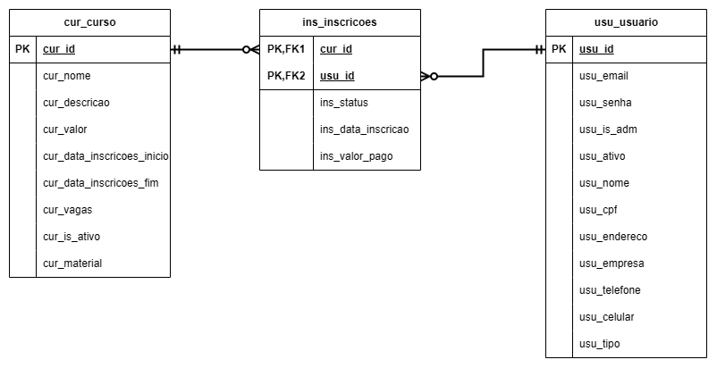

# Marcasite - Desafio para Vaga de Estágio

## Contexto

O objetivo deste teste é criar um sistema de inscrições para cursos, com gerenciamento dos dados dos alunos, diferenciação de valores por curso, integração com um gateway de pagamento (ex. PagSeguro, PayPal, Stripe ou PagarMe), controle de vendas com dados fictícios via sandbox, e uma área administrativa com funcionalidades como listagem de todos os inscritos, busca avançada feita pelo back-end sem uso de data-table, além da possibilidade de edição, exclusão e exportação de inscritos em Excel e PDF.

## Tecnologias Utilizadas

- **PHP 8.2**
- **Laravel 11** (usando os recursos do Laravel como Eloquent, validação, request, bibliotecas, migrations)
- **MySQL** (banco de dados)
- **Vue.js (versão 3)** - (Diferencial)
- **MVC (Modelo, Visão, Controlador)**

## Diagrama do Banco de Dados



## Manual do Usuário

### Clonar o Repositório

1. Clone o repositório para sua máquina:

```bash
git clone https://github.com/lima2206/MarcaSite.git
cd ./projeto
```

2. Configure as variáveis de ambiente no arquivo **.env**:
```env
APP_URL=http://localhost:8000

DB_CONNECTION=mysql
DB_HOST=127.0.0.1
DB_PORT=3306
DB_DATABASE=marcasite
DB_USERNAME=dev/
DB_PASSWORD=Senha132!
```

3. Crie o banco de dados no MySQL:

```sql
create database marcasite;
use marcasite;
create user "dev"@'localhost' identified by 'Senha132!';
grant all privileges on marcasite.* to 'dev'@'localhost';
flush privileges;
```

## Executando o Projeto
1. Abra um terminal e navegue até o diretório do projeto:

```bash
cd ./projeto
php artisan serve
```

2. Em outro terminal, instale as dependências do Vue.js:

```bash
cd ./projeto
npm install
npm run dev
```

3. Rodando!

Está rodando na url: http://localhost:8000/

## Considerações Finais
Apesar de ter tido um tempo muito limitado (aproximadamente 3 dias para concluir o projeto, sendo que o tempo real de trabalho foi pouco mais de 24 horas devido a compromissos pessoais), estou satisfeito com o resultado.

Fiz um planejamento no Trello que foi o que me permitiu pelo menos finalizar 90% do Projeto.

Infelizmente, não consegui integrar o gateway de pagamento devido a problemas de autenticação. Tentei por algumas horas, mas não consegui resolver (não ia pedir suporte no domingo, então deixei para finalizar as outras tarefas). No entanto, consegui aplicar os conceitos de MVC no backend e, apesar da bagunça e falta de planejamento, o frontend permanece estruturado.

Obrigado pela oportunidade!

